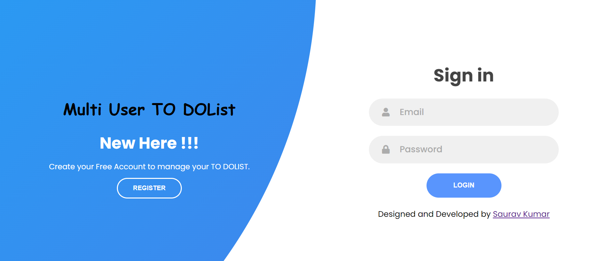

# Multi-User-To-DoList

• Designed and developed a Multi User To DoList.

• Enables users to sign up/login.

• It helps to increase the productivity of user.

• Stores the list of work user want to do,and when any work is done user can easily delete it from their list and can edit the list if required.

Stack used -

Front-end : HTML, CSS and Bootstrap(Framework)

Back-end : PHP

Database : MySQL

---

---

You can check my website: https://multi-user-todolist.000webhostapp.com/
